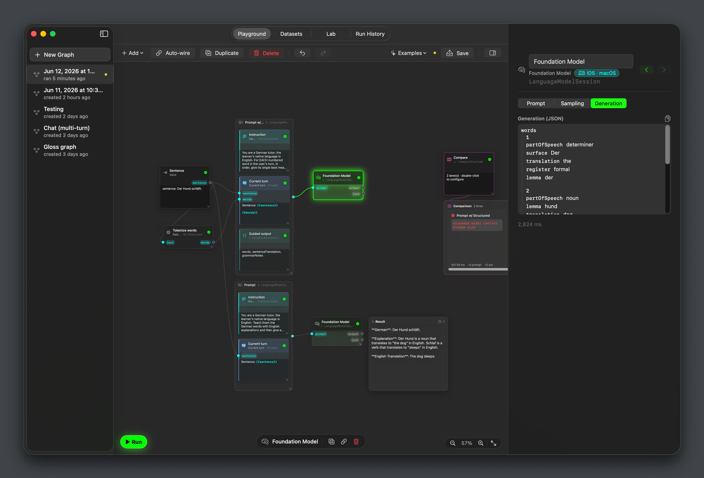
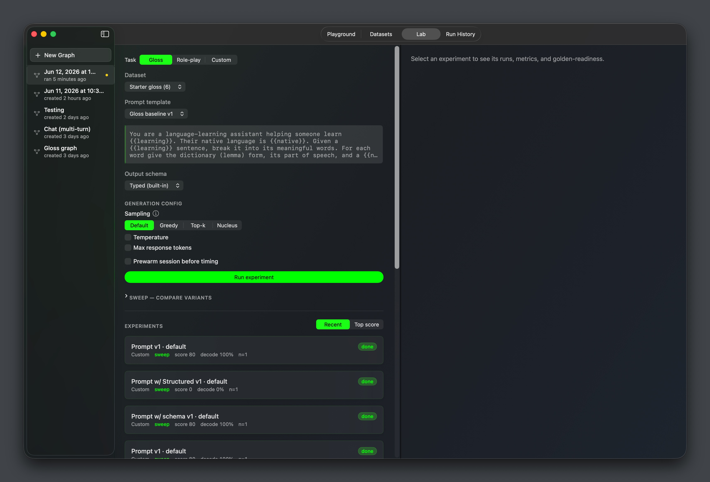
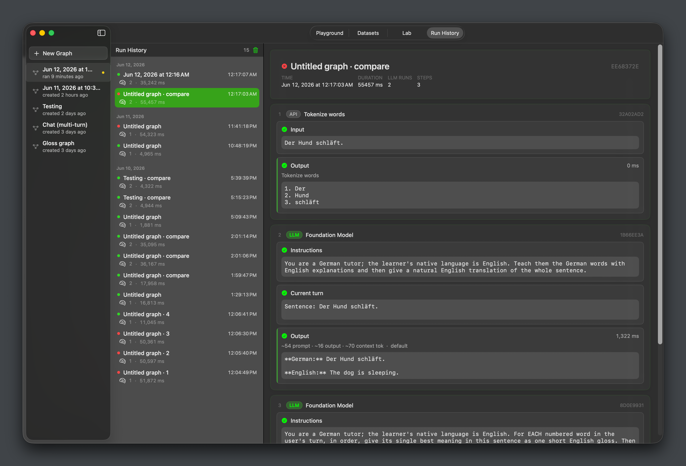

# NativeX Desktop

**A native macOS developer workbench for Apple's Foundation Models ecosystem.**

Design, orchestrate, evaluate, and trace prompt pipelines — without recompiling your iOS app on every iteration. Finalized prompts and schemas export directly into any iOS app with guaranteed on-device behavioral parity.

| Playground — visual graph editor | Evaluation Lab | Run History & tracing |
|:---:|:---:|:---:|
|  |  |  |

---

## Why NativeX

WWDC 2026 introduced the public **Foundation Models framework** and the open `LanguageModel` protocol — bringing on-device AI (Apple Intelligence), Private Cloud Compute, and third-party backends (Anthropic Claude, Google Gemini) under a single Swift API. Every developer building AI-powered iOS apps now faces the same inner-loop problem:

- Adjust a system prompt → rebuild the whole iOS app
- Iterate on a `@Generable` schema → recompile and redeploy
- Debug a multi-step pipeline → no native visual tracing surface
- Compare prompt variants → rewrite the same logic across branches

Every existing tool (LangChain, LangSmith, Promptfoo, Flowise) assumes an OpenAI-compatible cloud endpoint. None of them wrap Foundation Models, understand `@Generable`, respect the 4096-token on-device context ceiling, or run entirely offline.

NativeX Desktop is the missing workbench.

---

## Features

### Visual Graph Editor (Playground)


A node-DAG canvas for wiring together prompt pipelines — no recompilation required.

- **Prompt Groups** assemble `Instruction`, `Few-shot`, `History`, `Current Turn`, and `Guided Output` blocks into a `LanguageModelSession` request
- **Foundation Model node** targets any `LanguageModel` backend: on-device Apple Intelligence, Private Cloud Compute (32K-token context), or third-party providers via their official Swift packages
- **Native API nodes** — `NLTokenizer`, language detection, regex, JSON path extraction, Vision OCR, barcode reading, Spotlight search — run sandboxed with full iOS portability
- **Shell Hook nodes** — `/bin/zsh` pre/post processors for macOS-only workflows
- **Live execution feedback** — Dynamic Island-style pill names the running node; FM nodes emit a brief radiance glow on completion; errors surface as dismissible toasts
- **Portability badges** — every node carries an explicit **"iOS · macOS"** or **"macOS only"** badge so you always know what transfers to the client app

### Schema Modeling (Guided Generation)
Two lanes for prototyping structured outputs:

- **Typed lane** — compile-time `@Generable` structs, exported directly to the iOS client as production-ready Swift code
- **Dynamic lane** — build `DynamicGenerationSchema` trees at runtime in the UI, then promote to a typed `@Generable` via the built-in codegen engine

### A/B Compare Lane
Wire two (or more) Prompt Groups into a Compare node and run them side-by-side in a single topological pass — shared upstream nodes execute once, preserving the KV cache. Each lane registers as a separate experiment under a common sweep ID, linking the canvas directly to the Lab leaderboard. Lanes can target different backends, making cross-provider quality and latency comparison a single click.

### Evaluation Lab


LangSmith-style batch benchmarking, fully on-device:

- **Sweep Runner** fans a prompt variant across a dataset in a sequential, cancellable queue
- **Leaderboard** aggregates mean latency, token counts (exact on macOS 26.4+; heuristic fallback on earlier versions), and JSON decode rates
- **On-device evaluators**: reference-based string similarity matcher and LLM-as-a-Judge (1–5 rubric with Judge-vs-Human agreement scoring)

### Datasets
Master–detail dataset manager: create, curate, and import CSV/JSON files as evaluation corpora. Datasets are the shared data layer between Graph batch runs and Lab sweeps.

### Run History & Tracing


Offline execution log modeled after LangSmith — every graph run persists a trace tree showing per-node timing, the final formatted prompt, raw model output, and token accounting (input / output / KV-cached / reasoning on macOS 26.4+).

---

## Export to iOS

NativeX Desktop is the authoring workbench; iOS apps are the production runtime. Because the same on-device Foundation Model runs on both Apple Silicon Macs and iPhones, a prompt config that passes evaluation on the Desktop executes identically on-device.

Finalized graphs, prompt templates, and `@Generable` schemas export as portable files that drop directly into any iOS project — no manual copy-paste, no behavioral divergence.

---

## Requirements

| Requirement | Value |
|---|---|
| macOS | 26.0+ |
| Hardware | Apple Silicon (M-series) |
| Apple Intelligence | Enabled (Siri language must match device language) |
| Distribution | Direct (not Mac App Store — required for shell hook support) |

---

## Getting Started

```bash
git clone https://github.com/nlpotato/nativex-desktop
open "Prompt Playground.xcodeproj"
```

Run destination: **My Mac**. The app launches with seed datasets and starter graphs pre-loaded.

> **Note:** Foundation Models require Apple Intelligence enabled. On-device context is capped at 4,096 tokens; Private Cloud Compute extends this to 32,768 tokens.

---

## Architecture

```
App/              # Entry point + NavigationSplitView shell
Views/            # SwiftUI screens (GraphCanvas, NodeInspector, Lab, RunHistory, …)
Engines/          # @Observable view-models (GraphEngine, …)
Models/           # SwiftData models + GraphDef node tree
Core/             # Headless logic: GraphExecutor, GraphBatchRunner, GraphCompareRunner,
                  #   Pipeline, Judge, GoldenExport, HookEngine, SchemaBuilder, …
Tasks/            # Built-in test tasks (Gloss, Roleplay) — self-contained namespaces
DesignSystem/     # Tokens + theme
```

Every output schema runs in one of two lanes:

- **Typed** (default, ships to iOS) — compile-time `@Generable` structs; typed metrics; direct export
- **Dynamic** (prototyping) — runtime `DynamicGenerationSchema`; promote to typed via codegen

---

## Roadmap

- **NativeX iOS** — companion tool for on-device graph inspection within the iOS sandbox
- **Visual Agentic Pipeline Designer** — Apple's WWDC 2026 Baton-Pass and Phone-a-Friend multi-agent patterns as first-class graph nodes
- **Native API Browser** — inline Apple Developer Documentation for the selected node's underlying framework API
- **App Intents Tool Integration** — visual authoring of Foundation Models `Tool` declarations backed by App Intents
- **JavaScriptCore Script Hook** — sandboxed, iOS-portable script node (no sandbox-off required)
- **DSPy-Style Local Prompt Optimizer** — iterative on-device prompt refinement over developer-curated datasets

---

## Contributing

Issues, pull requests, and feedback welcome. See [CONTRIBUTING.md](CONTRIBUTING.md) for guidelines.

---

## License

MIT
